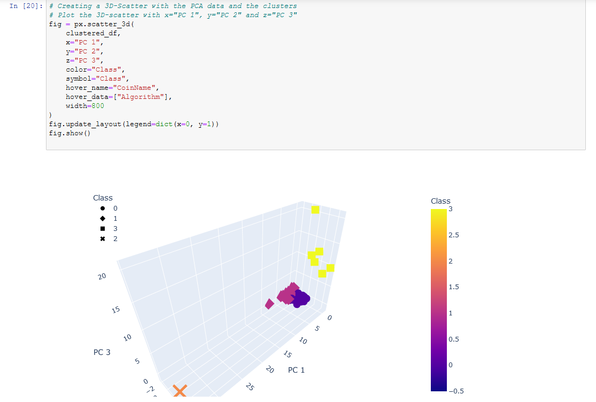
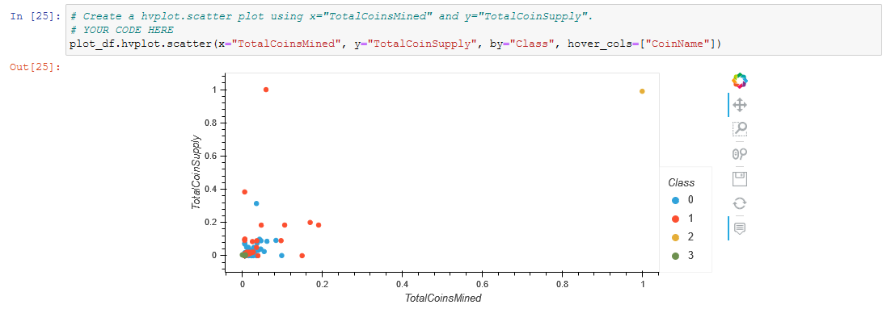

# Cryptocurrencies
## Purpose
As a class challenge, a dataset was provided from CryptoCompare (https://min-api.cryptocompare.com/data/all/coinlist)
and four deliverables were requested using this dataset as a starter.
## Description
As noted above, four deliverables were requested as follows: 
 - Deliverable 1: Preprocessing the Data for PCA
 - Deliverable 2: Reducing Data Dimensions Using PCA
 - Deliverable 3: Clustering Cryptocurrencies Using K-means
 - Deliverable 4: Visualizing Cryptocurrencies Results
 - The deliverables were implemented in a single jupyter notebook. 
 Note that two of the visualizations cannot be inspected directly in the output portion of the notebook cells
 without actually running the notebook in an environment where the dependencies have been installed.  Here is a screenshot of these
 to visualizations: 
  - 
  - 
